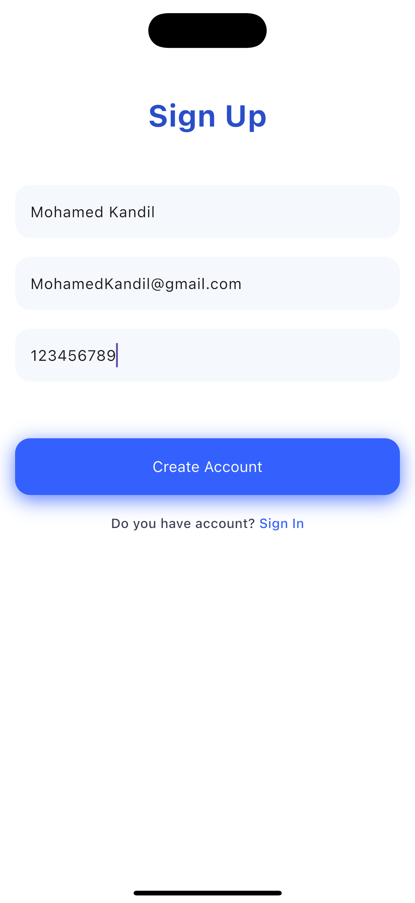
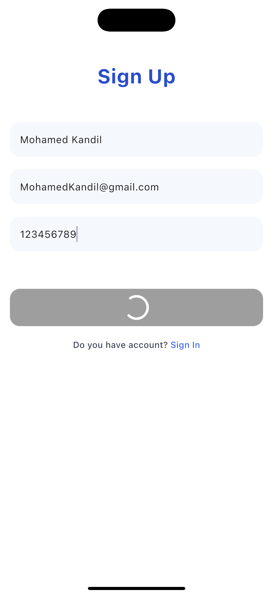
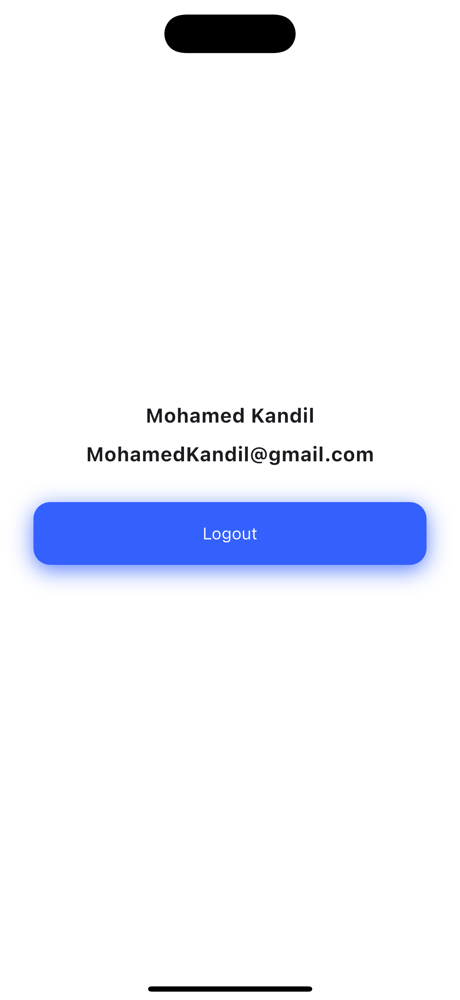

<<<<<<< HEAD
# Project Title

## Overview

This project is designed to provide a conceptual login application built with Flutter. It aims to demonstrate best practices in UI/UX design and authentication workflows for mobile applications.

## Features
- Feature 1: A secure and user-friendly login screen with form validation.
- Feature 2: Integration with a simple TypeScript server for authentication and user management.
- Feature 3: Responsive design ensuring compatibility across various screen sizes.

## Installation

1. Clone the repository:
    ```bash
    git clone https://github.com/Kandil7/login_app_concept.git
    ```
2. Navigate to the project directory:
    ```bash
    cd login_app_concept
    ```
3. Install dependencies:
    ```bash
    npm install
    ```

## Usage

To start the project, run the following command:
```bash
npm start
```


## Screenshots

### Feature 1


### Feature 2


### Feature 3


## Contributing

If you wish to contribute, please follow these steps:

1. Fork this repository.
2. Create a new branch: `git checkout -b feature/YourFeature`.
3. Make your changes and commit them: `git commit -m 'Add some feature'`.
4. Push to the branch: `git push origin feature/YourFeature`.
5. Submit a pull request.

## License

This project is licensed under the MIT License - see the [LICENSE](LICENSE) file for details.


=======
# Register & Login
📺 Watch Video

[YouTube video](https://youtu.be/UgCSVffNvqQ) where the source code is explained. [Subscribe YouTube channel](https://www.youtube.com/channel/UCkSbTj3XSWdaGfHiITheBqg).


>>>>>>> 11a1c36f46778dcd2565dddad0d19c0f2f6b31da
